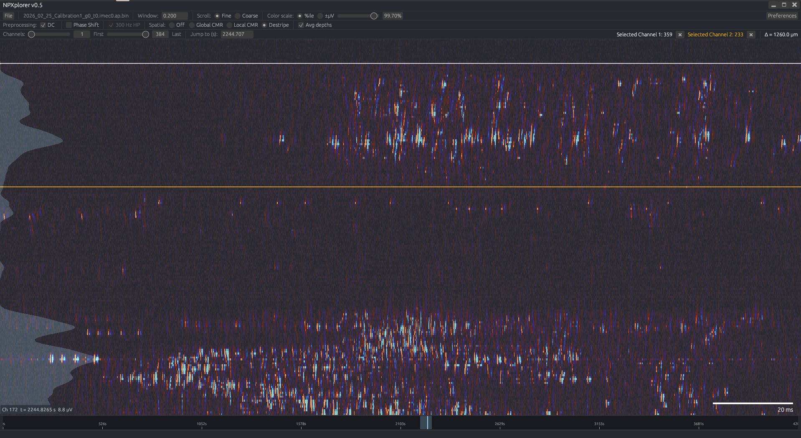

# NPXplorer v0.5

A lightweight viewer for raw Neuropixels electrophysiology data. Renders voltage traces as a heatmap mapped to the physical probe geometry in real time.

**This is beta software.** It has not been extensively tested across all recording configurations and probe types. Expect rough edges.



## Requirements

- Both data acquired with SpikeGLX or OpenEphys is supported. The format is detected automatically, and the app attempts to find the meta file.
- For SpikeGLX, both the AP and LFP bands are supported (`.ap.bin`/`.lf.bin`). The matching `.ap.meta`/`.lf.meta` next to the data file is used for each band.
- Data compressed with mtscomp is decompressed on-the-fly
- Tested with NP 1.0, NP 2.0 single-shank, and NP 2.0 multi-shank probes via SpikeGLX.
  OpenEphys support has only been tested against a single-shank NP 1.0 recording. Reading multi-shank data acquired with OpenEphys works in theory, but is untested.

## Usage

Just launch, and pick a file from the file dialog. 

### Navigation

- **Scroll wheel** moves the view forward/backward in time. The step size is 5% (Fine) or 30% (Coarse) of the current window width.
- **Arrow keys** or **A/D** jump half a window at a time.
- **Click on the navigation bar** at the bottom to jump to any point in the recording.
- **"Jump to (s)"** field lets you type an exact time in seconds.
- The navigation bar shows two markers in the colormap's accent color: a solid bar for the currently displayed window, and a fainter, wider shaded region behind it showing how much surrounding time has been preprocessed and is ready for smooth scrolling. The preprocessed chunk is automatically extended in the direction of scrolling once a certain margin (configurable in preferences) is met

### Selecting channels

- **Left-click** on the heatmap to select a channel (white marker line).
- **Right-click** to select a second channel (orange marker line).
- When both are selected, the vertical distance (Δ µm) between them is displayed.

This is useful for determining i.e. layer boundaries from ephys data.

### Preprocessing options

All filters run in real time on the displayed chunk. The pipeline order is fixed:

1. **DC removal** — subtracts the per-channel mean.
2. **Phase shift correction** — compensates the ADC multiplexing delay across channel groups using linear interpolation. The group size depends on the probe type.
3. **300 Hz highpass** — 3rd-order Butterworth, applied forward-backward (zero phase). Automatically enabled and locked on when Destripe is selected.
4. **Spatial filter** — choose one:
   - **Off** — no spatial filtering.
   - **Global CMR** — subtracts the median across all channels at sample.
   - **Local CMR** — subtracts the median of channels within a 100–400 µm annulus around each channel. Uses Euclidean distance from probe geometry.
   - **Destripe** — IBL-style kfilt: AGC normalization → spatial highpass (0.01 Wn Butterworth, forward-backward) → rescale. Includes mirror padding at probe edges.
5. **Avg depths** — when enabled, channels at the same depth on the same shank are averaged into a single display row.

For multi-shank probes, all spatial filters operate independently per shank.

### Spike projection overlay

A semi-transparent bar overlay on the left side of the heatmap shows threshold crossings per channel, computed over the visible time window. This gives a quick approximation of firing rate by depth.

All related settings are grouped under "Firing rate overlay" in Preferences:

- **Threshold** — default −40 µV. A 1.5 ms refractory period is enforced between counted crossings.
- **Overlay scale** — the overlay width scales with both the time window duration and the threshold (at −20 µV it has a baseline size; at −40 µV it's 2× as wide, at −80 µV it's 4×, etc.), multiplied by this manual factor. Default 1, i.e. no change.
- **Depth smoothing sigma** — standard deviation, in channels, of the Gaussian used to smooth the overlay across depth. Default 1.5.

### Color scale

- **Percentile mode** — the color range is set by a percentile of the absolute voltage distribution in the current buffer (default: 99th percentile, adjustable 95–100%).
- **±µV mode** — manually set the symmetric color range (10–300 µV).
- **Colormaps** — six options available in Preferences: Ice-Fire (default), Yellow-Magenta, Red-Blue, Orange-Blue, Vanimo, and Greyscale.

### PSTH (peri-stimulus average)

Click **PSTH** in the top bar and pick a file of stimulus onset times (`.csv`, `.txt`, `.tsv`, `.dat`; UTF-8/UTF-16/Latin-1 are handled). For each stimulus, the preprocessed signal in a window around the onset is averaged across stimuli (mean, using the main window's current preprocessing settings). The window shows three plots sharing a time axis: the selected-channel traces, the mean across the channel range, and a heatmap over all channels in the range.

Set the controls, then press **Apply settings** to compute or recompute:

- **Channels** — first/last channel to include.
- **Stim time (s)** — only stimuli whose onset falls in this range are averaged. Defaults to the whole recording.
- **Window (ms)** — start and end of the peri-stimulus window relative to onset (e.g. −50 to 200).
- **Color scale** — percentile or ±µV, as for the main heatmap. Changing it re-colors without recomputing.

**Left-click / right-click** the heatmap to plot a channel's trace (white / orange, up to two). **Deselect** clears them. **Export PNG…** writes the three plots to an image; the default filename is `<recording>_<stim file>_psth.png`.

Stimulus onset times are read according to a layout file. Each line of the layout mirrors the structure of the stim file: leading lines without an `o` are header rows to skip, and the first line containing `o` marks which comma-separated column(s) hold the onset times (in seconds); `x` marks columns to ignore, and trailing `x` beyond the file's columns are ignored. For example:

```
header
o,x,x
```

skips one header row and reads onsets from the first column. A `stims_file_layout.csv` placed next to the stim file is used if present; otherwise the default at `config/stims_file_layout.csv` (next to the executable) applies. If the layout does not match the file, an error describing the mismatch is shown.

## Configuration

Preferences are saved to `config/npxplorer_prefs.toml` in a `config/` folder next to the executable (a `npxplorer_prefs.toml` left next to the executable by an older version is still read if the new one is absent). This includes preprocessing settings, colormap, color scale mode, spike threshold, window duration, and the last opened directory. The `config/` folder also holds the default `stims_file_layout.csv` used by the PSTH tool; it is created on first launch.

The Preferences window also exposes background prefetch tuning:

- **Initial buffer size (s)** — total width of the preprocessed buffer loaded on initial load, on a config change, or on a jump to an unloaded region. Also the steady-state size that continuous scrolling settles back to. Default 30 s, clamped to what currently-available system memory allows.
- **Extension margin (s)** — how close the view is allowed to get to the edge of the preprocessed buffer before more is fetched in that direction; also the size of each fetch. Default 5 s, capped well below a third of the initial buffer size so growing on one side and trimming the other can't oscillate back and forth.
- **Memory pressure threshold (%)** / **Memory reserve (MB)** — while scrolling continuously in one direction, the buffer keeps growing without trimming the trailing side, up to the initial buffer size. If free system memory drops below either threshold first, growth stops (net-zero: trimming keeps pace with further extension) rather than waiting to hit the size cap.

## Building from source

Requires Rust (stable). Build with:
```bash
cargo build --release
```

## Known limitations

- Only tested on SpikeGLX (`.ap.bin`/`.lf.bin`/`.ap.cbin`) and OpenEphys binary format (`continuous.dat`/`.cbin`).
- Compressed `.cbin` files are a bit slower to navigate since each chunk must be decompressed on the fly.
- OpenEphys: only a single probe/stream per file is handled — if a `PROCESSOR` block in `settings.xml` contains multiple `NP_PROBE` entries (multiple probes on one PXI card), only the first is used.
- OpenEphys: multi-shank NP 2.0 geometry and multi-experiment/multi-recording sessions are untested (see Requirements).
