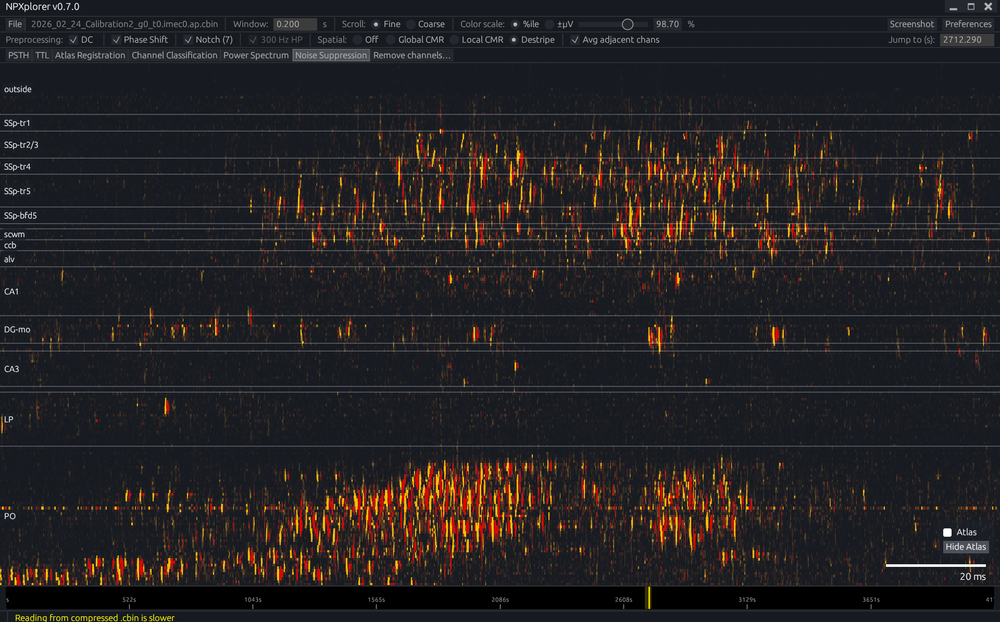

# NPXplorer v0.6.0

A viewer for raw Neuropixels recordings. Shows the voltage of all channels as a heatmap laid out by the probe geometry.

**This is beta software.** It has not been tested with all recording configurations and probe types.



## Supported data

- SpikeGLX (`.ap.bin`, `.lf.bin`) with the matching `.meta` file next to it.
- Open Ephys binary format (`continuous.dat`); `structure.oebin` and `settings.xml` are found automatically.
- mtscomp-compressed files (`.cbin` with its `.ch` file).
- Tested with NP 1.0, NP 2.0 single-shank and NP 2.0 multi-shank probes (SpikeGLX), and a single-shank NP 1.0 recording from Open Ephys.

## Usage

Launch the app and pick a recording. **File > Recent files** lists the last 5 recordings.

Channels are named as in the recording's metadata (e.g. `AP12` for SpikeGLX, `CH13` for Open Ephys), everywhere in the app and in exported files.

### Navigation

- **Scroll wheel**: move forward/backward in time (step size set by **Fine**/**Coarse** in the top bar).
- **Arrow keys** or **A/D**: jump half a window.
- **Window**: length of the displayed time window in seconds.
- **Jump to (s)** (right end of the second toolbar row): go to a time.
- Click the **navigation bar** at the bottom to jump anywhere. The solid marker shows the displayed window, the shaded area the part that is already preprocessed.
- **Esc**: closes the topmost open window (PSTH, Atlas Registration, Preferences, …), one per press.

The heatmap always shows every channel that is not removed (see **Removing channels**). The status bar lists anything the recording's metadata did not provide (e.g. an unknown probe type, whose gain and electrode positions are then assumed), so you know when µV values or depths are nominal.

### Selecting channels

- **Alt + left-click** a row to select a channel, **Alt + right-click** to select a second one. With two selected, their vertical distance (Δ µm) is shown in the top right.
- **Right-click** a row for a menu: **View waveform** shows that channel's trace (Alt + scroll changes its vertical scale, **✖** returns to the heatmap), **Remove channel** excludes it.

### Removing channels

**Remove channels…** in the third toolbar row excludes channels from the display and from all processing. Enter channel IDs or ranges separated by commas (e.g. `AP3,AP17,AP40-AP50`) and press **Apply** or Enter; a bare number (`17`, `40-50`) matches the channels whose ID ends in that number. **Load from file…** reads the list from a `.csv`/`.txt`/`.tsv`/`.dat` file, using a layout file like the PSTH one (see below): `channel_remove_layout.csv` next to the list file, or the default in `config/`. **Reset** clears the list.

When a recording is opened, the list starts with the probe's reference sites, which carry no neural signal (e.g. channel 191 on NP 1.0): those SpikeGLX marks as unused in its geometry map, and those Open Ephys lists without a position. **Reset** includes them again.

### Preprocessing

The second toolbar row sets the preprocessing applied to the display:

- **DC**: remove each channel's mean.
- **Phase Shift**: correct the sampling delay between channels. Channels sharing an ADC are digitised one after another within each sample period; the delay of every channel is taken from the recording's `~muxTbl` (SpikeGLX) or from the probe type, and removed with a windowed-sinc fractional-delay filter on each raw channel before any averaging.
- **300 Hz HP**: zero-phase highpass filter (always on with Destripe).
- **Spatial**: **Off**, **Global CMR** (subtract the median of all channels of the shank), **Local CMR** (median of nearby channels), or **Destripe** (IBL-style). Destripe's spatial filter runs along physical depth over each stretch of neighbouring electrodes — it never mixes channels across a gap in the layout (drawn as a dotted line) or across shanks, whatever the display order.
- **Avg adjacent chans**: average channels at the same depth into one row.

Voltages are scaled per channel from the metadata: SpikeGLX gains from `~imroTbl` (or `imChan0apGain`, or the fixed gain of the probe type), Open Ephys `bit_volts`.

### Color scale

- **%ile**: the color range follows a percentile of the displayed voltages; **±µV**: a fixed range. **Alt + scroll** adjusts either.
- **Colormap** (Preferences): Ice-Fire, Yellow-Magenta, Red-Blue, Orange-Blue, Vanimo, Greyscale, Cool-Warm.
- **Peak pooling** (Preferences, off by default): when a pixel column covers many samples (long windows), it shows the sample with the largest magnitude instead of the mean, so spikes keep their amplitude at any window length. In **%ile** mode the colour range then follows the values on screen. Off gives a smoother, mean-based picture (better for LFP).

### Firing rate overlay

A bar on the left of the heatmap shows the number of threshold crossings per channel in the displayed window. Settings under "Firing rate overlay" in Preferences: **Show firing rate overlay**, **Spike Threshold** (default −40 µV), **Overlay scale**, and **Depth smoothing sigma**.

### Channel layout

In Preferences:

- **Order channels by**: **Depth** (default; deepest channel at the bottom) or **ID**.
- **Order shanks by**: **ID** (default) or **x coordinate**.

### Channel classification

**Channel Classification** in the third toolbar row marks dead (magenta), noisy (red) and out-of-brain (green) channels with a colored stripe. Each shank is classified on its own with the channels in depth order; removed channels are skipped. **Outside of brain** (Preferences) chooses how the brain surface is found: **Adaptive** (default; IBL's adaptive mode, finds weaker surfaces, e.g. in LFP data) or **Fixed threshold** (IBL's default, stricter). A progress bar with **Abort** shows while it runs. The box in the heatmap's bottom-right corner, above the scale bar, shows the legend; its **Hide**/**Show** button hides or shows the stripes. **Chunks to sample** in Preferences sets how many snippets of the recording are used (more is more reliable but slower).

### Atlas registration

Draws the borders between brain regions of the Allen mouse atlas (CCF) on the heatmap, from the probe's insertion coordinates. It uses the atlas files of the [Neuropixels Trajectory Explorer](https://github.com/petersaj/neuropixels_trajectory_explorer): a folder containing `annotation_volume_10um_by_index.npy` and `structure_tree_safe_2017.csv`.

Click **Atlas Registration** in the third toolbar row:

1. Choose the atlas folder with **Browse…**, or paste its path.
2. Enter the animal's bregma–lambda distance (default 4.1 mm).
3. Enter the insertion point (AP and ML in mm from bregma; AP positive = anterior, ML positive = right) and the angles, either as **Azimuth / elevation / rotation** (azimuth from the lambda→bregma axis, elevation from horizontal) or as **Polar / azimuth / roll** (polar angle from vertical, azimuth from +ML). Rotation/roll turns the probe around its axis, which matters for multi-shank probes.
4. Enter the insertion depth (from the brain surface to the tip, along the probe) and the distance from the tip to the first electrode row (default 195 µm).
5. Press **Apply**.

The heatmap then shows the region borders, with each region's acronym on the left (hover for the full name); the hovered channel's region also appears in the readout at the bottom left. **Region level** chooses between the finest level (including cortical layers) and coarser levels. **Show overlay** hides or shows it. With channels ordered by ID, borders and labels are hidden.

To match the borders to the data:

- Adjust the depth with **⏶/⏷** (10 µm steps) or the slider; the overlay follows immediately.
- **Alt + drag** any border to move all borders together; the depth field follows.
- **Drag** a single border to move just that one (it stops at its neighbors). Dragged borders are kept when the depth changes, and only **Reset borders** undoes them.

**Save** writes `<recording>_regions.csv` next to the data file, with each channel's ID and region.

The window also lists the regions along the probe from the brain surface to the tip (per shank on multi-shank probes), marking those covered by recorded channels, plus the entry and tip coordinates and warnings.

The coordinates and dragged borders are saved in `<recording>.npx_atlas.toml` next to the data file (shared by the AP and LF files) and filled in when the recording is opened again. The atlas itself is only loaded when you press **Apply** or tick **Show overlay**.

### PSTH (peri-stimulus average)

Click **PSTH** and pick a file with stimulus onset times in seconds (`.csv`, `.txt`, `.tsv`, `.dat`). The window shows the average signal around the stimuli for all channels that are not removed, using the main window's preprocessing: traces of selected channels, the mean over all channels, and a heatmap.

Set **Stim time (s)** (which stimuli to include), **Window (ms)** (e.g. −50 to 200) and the color scale, then press **Apply settings**. A progress bar with **Abort** shows while it computes. **Left-click / right-click** the heatmap to plot up to two channels; **Deselect** clears them. **Export PNG…** saves the plots.

The stimulus file is read according to a layout file. Its lines mirror the stim file: lines without an `o` are header rows to skip, and the first line with an `o` marks the column(s) holding the onset times (`x` = ignore). For example

```
header
o,x,x
```

skips one header row and reads the first column. A `stims_file_layout.csv` next to the stim file is used if present, otherwise the default in `config/`. Lines starting with `#` are comments.

## Configuration

Preferences are saved in `config/npxplorer_prefs.toml` next to the executable, together with the default layout files for PSTH and Remove channels. The list of removed channels is not saved.

The **Buffer** section in Preferences controls how much of the recording is preprocessed ahead of time: **Initial buffer size**, **Extension margin**, and the memory limits (**Memory pressure threshold**, **Memory reserve**) at which the buffer stops growing.

## Building from source

Requires Rust (stable):

```bash
cargo build --release
```

## Known limitations

- `.cbin` files are slower to navigate, since they are decompressed on the fly.
- Open Ephys: only the first probe of a `settings.xml` processor is used; multi-shank probes and multi-experiment/multi-recording sessions are untested.
- SpikeGLX recordings older than 20230202 have no `~snsGeomMap`; electrode positions are then rebuilt from `~snsShankMap` and the probe type's pitch. Unknown probe types fall back to a nominal single column at 20 µm and a warning in the status bar.
